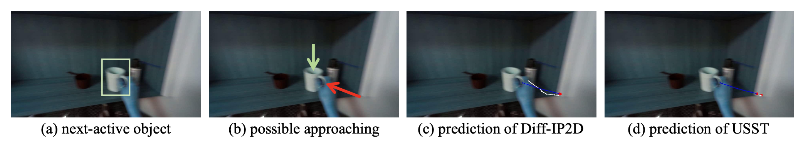

# Diff-IP2D: Diffusion Models for Joint HOI Prediction

This is the official implementation for our paper: 

[Diff-IP2D: Diffusion-Based Hand-Object Interaction Prediction on Egocentric Videos](https://arxiv.org/abs/2405.04370).

[Junyi Ma](https://github.com/BIT-MJY)<sup>1</sup>, [Jingyi Xu](https://github.com/BIT-XJY)<sup>1</sup>, [Xieyuanli Chen](https://xieyuanli-chen.com/)<sup>2</sup>, [Hesheng Wang](https://scholar.google.com/citations?hl=en&user=q6AY9XsAAAAJ&view_op=list_works&sortby=pubdate)<sup>1*</sup>

<sup>1</sup>SJTU&emsp;&emsp;<sup>2</sup>NUDT&emsp;&emsp;<sup>*</sup>Corresponding author


Diff-IP2D is the first work using the devised denoising diffusion probabilistic model to jointly forecast future hand trajectories and object affordances with only 2D egocentric videos as input. It provides a foundation generative paradigm in the field of HOI prediction.


white: ours, blue: baseline, red: GT. Diff-IP2D generates plausible future hand waypoints and final hand positions (even if there is a large error in the early stage) with bidirectional constraints.



The hand waypoints from ground-truth labels and HOI prediction approaches are connected by blue and white dashed lines respectively. **There is a lack of backward constraints in AR-based USST, leading to a shorter predicted trajectory (almost curled up into a point) and larger accumulated displacement errors. In contrast, our Diff-IP2D with iter-NAR paradigm is potentially guided by final HOI states, and thus predicts more accurate hand trajectories following both spatial causality and temporal causality.**


If you find our work helpful to your research, please cite our paper as
```
@article{ma2024diffip2d,
  title={Diff-IP2D: Diffusion-Based Hand-Object Interaction Prediction on Egocentric Videos},
  author={Ma, Junyi and Xu, Jingyi and Chen, Xieyuanli and Wang, Hesheng},
  journal={arXiv preprint arXiv:2405.04370},
  year={2024}}
```

## 1. Setup

Clone the repository (requires git):

```bash
git clone https://github.com/IRMVLab/Diff-IP2D.git
cd Diff-IP2D
```

Create the environment and install dependencies into it:

```bash
conda create -n diffip python=3.8 pip
conda activate diffip
pip install -r requirements.txt
```

## 2. Data Structure

We suggest using our proposed data structure for faster reproducing, which is posted here:

```bash
├── base_models
│   └── model.pth.tar
├── common
│   ├── epic-kitchens-100-annotations # from OCT or merged ourselves
│   │   ├── EPIC_100_test_timestamps.csv
│   │   ├── EPIC_100_test_timestamps.pkl
│   │   ├── EPIC_100_train.csv
│   │   ├── EPIC_100_train.pkl
│   │   ├── EPIC_100_train_val_test.csv
│   │   ├── EPIC_100_verb_classes.csv
│   │   ├── EPIC_100_video_info.csv
│   │   ├── actions.csv
│   │   └── ...
│   └── rulstm # raw rulstm repo
│       ├── FEATEXT
│       ├── FasterRCNN
│       └── RULSTM
├── data
│   ├── ek100 # manually generated ourselves or from OCT or from raw EK
│   │   ├── feats_train
│   │   │   ├── full_data_with_future_train_part1.lmdb
│   │   │   └── full_data_with_future_train_part2.lmdb
│   │   ├── feats_test
│   │   │   └── data.lmdb
│   │   ├── labels # 
│   │   │   ├── label_0.pkl
│   │   │   └── ...
│   │   ├── ek100_eval_labels.pkl
│   │   └── video_info.json
│   ├── raw_images # raw EPIC-KITCHENS dataset
│   │   └── EPIC-KITCHENS
│   ├── homos_train # auto generated when first running
│   ├── homos_test # auto generated when first running  
├── diffip_weights # auto generated when first saving checkpoints
│   ├── checkpoint_1.pth.tar
│   └── ...
├── collected_pred_traj # auto generated when first eval traj
├── collected_pred_aff # auto generated when first eval affordance
├── log # auto generated when first running
└── uid2future_file_name.pickle
```

## 3. Access to Required Files
Here we provide the links to access all the above-mentioned files that cannot be generated automatically by running scripts of this repo:
* [base_models/model.pth.tar](https://drive.google.com/file/d/16IkQ4hOQk2_Klhd806J-46hLN-OGokxa/view): Base model from OCT [1].
* [common/epic-kitchens-100-annotations](https://1drv.ms/u/c/0e8794c880029a8f/EVhoi5yXoGNKh0FGUFNgQM4Ba26rLoBaN4cmDTaOyj9WVA?e=5JypW7): Annotations from raw EK [2] and our mannually merged files. Please do not confuse this folder with the one provided by OCT [1].
* [common/rulstm](https://github.com/fpv-iplab/rulstm): Original RULSTM [3] repo.
* [data/ek100/feats_train](https://1drv.ms/u/c/0e8794c880029a8f/EYne7Qr09u1Mie-3N0U0CkgB1c-72AguS5nj0mGojLIflg?e=KMi2Mn): Our mannually generated feature files for training our model.
* [data/ek100/feats_test](https://1drv.ms/u/c/0e8794c880029a8f/EfqtPairdOxJudetBi66Fz4BxN1W6c7TXFjcVUIJFfJrxA?e=IZ5j3U): Feature files provided by OCT [1] for testing our model.
* [data/ek100/labels](https://1drv.ms/u/c/0e8794c880029a8f/EXTy2gkcv69LrvyYMGcZ5YsBi949htwa60QGEVCcIkv-4w?e=UM38ap): Labels from OCT [1] for training models.
* [data/ek100/ek100_eval_labels.pkl](https://drive.google.com/file/d/1s7qpBa-JjjuGk7v_aiuU2lvRjgP6fi9C/view): Labels from OCT [1] for affordance evaluation. Please refer to the original OCT folder. 
* [data/ek100/video_info.json](https://1drv.ms/u/c/0e8794c880029a8f/ERcBH9ic9AxMg5czXFkFqooBlF-q-TQS1kHyJ3L6iUt0vQ?e=wdEtBK): Used video index.
* [data/raw_images](https://github.com/epic-kitchens/epic-kitchens-100-annotations): Original EK images [2]. Following the instructions in EK repo for downloading raw RGB images by `python epic_downloader.py --rgb-frames` since only raw images are required in Diff-IP2D.
* [uid2future_file_name.pickle](https://1drv.ms/u/c/0e8794c880029a8f/EQAUO4TrytBJp--tziBD8q0B1RooqdzotTGlRNkX6o-qtQ?e=v83ehP): Indicator generated ourselves.

## 4. How to Use

We have released the deployment of Diff-IP2D on EK100. We are going to release relevant codes and data on EK55 and EG soon ...

### 4.1 Pretrained Weights 

| Version | Download link | Notes |
|----|----|----|
| 1.1 | [OneDrive]() / [Google Drive]() | pretrained on EK100 (two val) |
| 1.2 | [OneDrive]() / [Google Drive]() | pretrained on EK100 (one val) |

Please change the paths to pretrained weights in `run_train.py`, `run_val_traj.py`, and `run_val_affordance.py`.

### 4.2 Train

```bash
bash train.sh
```

### 4.3 Test

Please test trajectory prediction by

```bash
bash val_traj.sh
```

Test affordance prediction by 

```bash
bash val_affordance.sh
```

### 4.4 Other Notes

* We are working hard to organize and release a more polished version of the code, along with its application on the new dataset.
* You may obtain results that slightly differ from those presented in the paper due to the stochastic nature of diffusion inference with different seeds. Prediction clusters can be obtained using multiple different seeds.
* Homography will be automatically saved to `data/homos_train` and `data/homos_test` after the first training/test epoch for quick reuse. 
* Separate validation sets will lead to checkpoints at different epochs for two tasks.
* Please modify the params in [config files]() before training and testing. For example, change the paths in `options/expopts.py`. You can also set `fast_test=True` for faster inference without sacrificing much accuracy.

## 5. Acknowledgment


We sincerely appreciate the fantastic pioneering works that provide codebases and datasets for this work. Please also cite them if you use the relevant code and data.

[1] Shaowei Liu, Subarna Tripathi, Somdeb Majumdar, and Xiaolong Wang. Joint hand motion and interaction hotspots prediction from egocentric videos. In CVPR, pages 3282–3292, 2022. [Paper]() [Code]()

[2] Dima Damen, Hazel Doughty, Giovanni Maria Farinella, Antonino Furnari, Evangelos Kazakos, Jian Ma, Davide Moltisanti, Jonathan Munro, Toby Perrett, Will Price, et al. Rescaling egocentric vision: Collection, pipeline and challenges for epic-kitchens-100. IJCV, pages 1–23, 2022. [Paper]() [Code]()

[3] Antonino Furnari and Giovanni Maria Farinella. Rolling-unrolling lstms for action anticipation from first-person video. IEEE TPAMI, 43(11):4021–4036, 2020. [Paper]() [Code]()

[4] Shansan Gong, Mukai Li, Jiangtao Feng, Zhiyong Wu, and Lingpeng Kong. Diffuseq: Sequence to sequence text generation with diffusion models. In ICLR, 2023. [Paper]() [Code]()

[5] Wentao Bao, Lele Chen, Libing Zeng, Zhong Li, Yi Xu, Junsong Yuan, and Yu Kong. Uncertainty-aware state space transformer for egocentric 3d hand trajectory forecasting. In ICCV, pages 13702–13711, 2023. [Paper]() [Code]()
